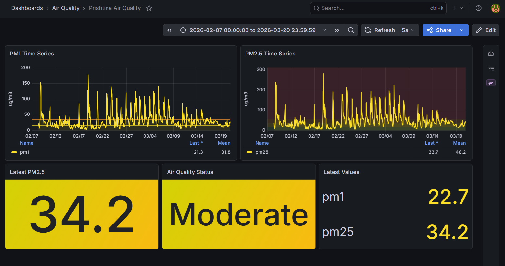

<table border="0">
 <tr>
    <td>
      <p>Universiteti i Prishtinës/ University of Prishtina</p>
      <p>Fakulteti i Inxhinierisë Elektrike dhe Kompjuterike</p>
      <p>Inxhinieri Kompjuterike dhe Softuerike - Programi Master</p>
      <p>Profesor:Besmir Sejdiu</p>
    </td>
 </tr>
</table>

# Sistemi IoT per Monitorimin e Cilesise se Ajrit

Ky projekt implementon nje pipeline IoT per monitorimin e cilesise se ajrit duke perdorur nje simulator GUI qe gjeneron te dhena sintetike ne kohe reale.

```text
Simulator -> MQTT/Mosquitto -> Kafka -> Spark -> Cassandra -> Grafana
```

Simulatori perfaqeson sensore optike te tipit AirGradient dhe transmeton matje PM1 dhe PM2.5 ne MQTT. Numri i sensoreve dhe frekuenca e dergimit kontrollohen nga GUI-ja e simulatorit.

## Cfare Eshte Implementuar

- GUI per simulatorin ne `http://localhost:5000`.
- Paneli i Sensoreve me numrin e sensoreve, Start dhe Stop.
- Konfigurimi i numrit te sensoreve dhe frekuences se dergimit ne milisekonda.
- Live Data shfaq vlerat e fundit per sensoret aktiv.
- Simulatori gjeneron PM1/PM2.5 vazhdimisht, pa lexuar nga CSV/Excel.
- P.sh. 1000 sensore cdo 100ms prodhojne rreth 10,000 matje/sec.
- Bridge MQTT-to-Kafka i dergon mesazhet ne topic Kafka `air-quality`.
- Spark Structured Streaming lexon mesazhet nga Kafka dhe llogarit statusin e cilesise se ajrit.
- Cassandra ruan te dhenat e procesuara ne skemen e kerkuar.
- Grafana konfigurohet automatikisht me datasource per Cassandra dhe dashboard te gatshem.

## Formati i te Dhenave

Simulatori publikon mesazhe JSON te ketij tipi:

```json
{
  "timestamp": "2026-06-01T17:30:00.000000+00:00",
  "pm1": 13.742,
  "pm2.5": 22.511,
  "sensor_id": "airgradient_prishtina_001",
  "location": "Prishtina, Kosovo",
  "latitude": 42.670917,
  "longitude": 21.151694,
  "relativehumidity": 58.2,
  "temperature": 18.7,
  "um003": 3376.65,
  "unit": "ug/m3"
}
```

## Klasifikimi ne Spark

Spark e llogarit statusin nga PM2.5 gjate procesimit te stream-it:

```text
PM2.5 <= 15  -> Good
PM2.5 <= 35  -> Moderate
PM2.5 <= 55  -> Unhealthy
PM2.5 > 55   -> Very Unhealthy
```

Klasifikimi nuk ruhet ne CSV. Ai llogaritet ne `src/processor/processor.py` dhe pastaj ruhet ne Cassandra.

## Skema e Cassandra

Procesori e krijon automatikisht kete tabele:

```sql
CREATE TABLE air_quality.air_quality (
    sensor_id text,
    timestamp timestamp,
    pm1 float,
    pm2_5 float,
    status text,
    location text,
    PRIMARY KEY (sensor_id, timestamp)
) WITH CLUSTERING ORDER BY (timestamp DESC);
```

## Dashboard ne Grafana

Grafana konfigurohet automatikisht nga fajllat ne `docker/grafana`.

Panelet e perfshira:

- Grafiku kohor per PM1
- Grafiku kohor per PM2.5
- Paneli i statusit te cilesise se ajrit
- Paneli me vlerat me te fundit
- Vizualizim me ngjyra sipas pragjeve te PM2.5

## Ekzekutimi

Nga folderi i projektit, ekzekuto:

```powershell
docker compose up --build
```

Nese projekti eshte ekzekutuar me skemen e vjeter te PM2.5, rekomandohet nje reset i volumave nje here:

```powershell
docker compose down -v
docker compose up --build
```

Sherbimet hapen ketu:

- Simulator GUI: http://localhost:5000
- Grafana: http://localhost:3000
- Spark master UI: http://localhost:8080
- MQTT: `localhost:1883`
- Cassandra: `localhost:9042`


Dashboard-i gjendet ketu:

```text
Dashboards -> Air Quality -> Prishtina Air Quality
```



## Perdorimi i Simulatorit

Hap GUI-ne:

```text
http://localhost:5000
```

Nga aty cakto:

- Numrin e sensoreve, p.sh. `1000`.
- Frekuencen e dergimit, p.sh. `100` ms.
- Kliko `Start` per te filluar publikimin ne MQTT.
- Kliko `Stop` per ta ndalur simulatorin.

Nese numri i sensoreve eshte `3`, simulatori krijon 3 sensore virtuale:

```text
airgradient_prishtina_001
airgradient_prishtina_002
airgradient_prishtina_003
```

Te dhenat vazhdojne te vijne derisa klikohet `Stop` ose ndalet Docker-i. Frekuenca `1000 ms` do te thote qe cdo 1 sekonde dergohet nje batch me matje per te gjithe sensoret. Pra `3` sensore me `1000 ms` japin rreth `3 matje/sec`, ndersa `1000` sensore me `100 ms` japin rreth `10,000 matje/sec`.

Live Data ne GUI shfaq vlerat e fundit, p.sh.:

```text
Sensor 1 -> 22.5
Sensor 2 -> 19.8
Sensor 3 -> 25.1
```

## Verifikimi

Gjendja dhe matjet live shihen ne Simulator GUI. Per debug mund te kontrollohen edhe log-et:

```powershell
docker compose logs -f simulator
```

Bridge-in MQTT-to-Kafka:

```powershell
docker compose logs -f bridge
```

Procesimin ne Spark:

```powershell
docker compose logs -f processor
```

Kontrollimi i te dhenat ne Cassandra:

```powershell
docker compose exec cassandra cqlsh -e "SELECT * FROM air_quality.air_quality LIMIT 10;"
```

Kontrollimi nese Kafka topic ekziston:

```powershell
docker compose exec kafka /opt/kafka/bin/kafka-topics.sh --bootstrap-server kafka:9092 --list
```

Duhet te shfaqet:

```text
air-quality
```

Ndalo container-at duke ruajtur te dhenat:

```powershell
docker compose down
```

Ndalo container-at dhe fshi volumet e Cassandra/Grafana/Kafka:

```powershell
docker compose down -v
```
